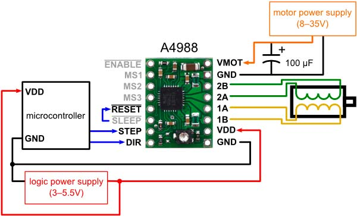
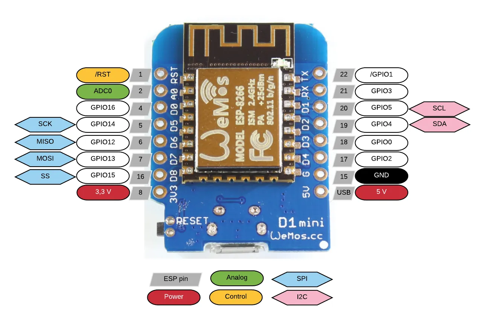
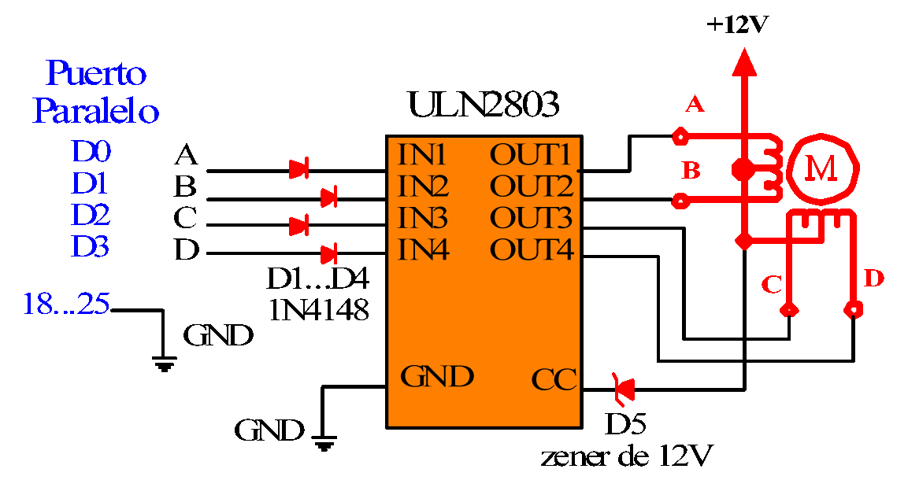

# comedero para mascotas
Comedero para mascotas con ESP8266 ESP32 Arduino y motor de pasos

  Comedero para mascotas, by ISET 57, 2024.

  Primera version:
 
  Tiene un timer que activa el motor cada ciertas horas.
 
  La idea es que la mascota pueda comer digamos a las 12 hs y luego a las 21 hs.
 
  Seria un primer evento en el minuto 0 y luego en el minuto 540.
 
  Luego espera durante 900 minutos para pasar al minuto 0, y comienza de nuevo el ciclo.

  - Usa un motor de pasos para mover el mecanismo.
  - Se puede usar un ESP8266, un ESP32, o un Arduino UNO/Nano.
  - Tiene un boton de reset, para marcar el comienzo del minuto 0.
  - Se enciende un LED parpadeante para indicar que está vivo.
  - Cuando funciona el motor, el LED permanece encendido.

  - Podrian agregarse mas LEDS o displays.
  - Tambien podría ser un parlante para generar sonido para acostumbrar a la mascota a comer.

  El motor usa un POLOLU A4988 como driver.
  https://www.pololu.com/docs/0J40/0J40.pdf

  

  

  